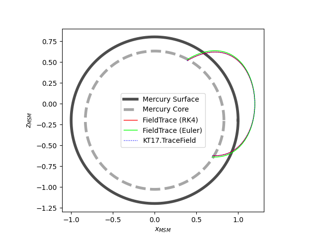

# FieldTracing

This is a very simple Python module to trace fields (e.g. magnetic fields) when provided with a model.

## Installation

Install using `pip3`:

```bash
pip3 install --user FieldTracing
```

Or by cloning this repo:

```bash
#clone the repo
git clone https://github.com/mattkjames7/FieldTracing
cd FieldTracing

#Either create a wheel and use pip: (X.X.X should be replaced with the current version)
python3 setup.py bdist_wheel
pip3 install --user dists/FieldTracing-X.X.X-py3-none-any.whl

#Or by using setup.py directly
python3 setup.py install --user

```

## Usage

There are two tracing routines in this model: `FieldTracing.Euler.EulerTrace` - this is the most basic tracing routine, which will step in the direction of the field using the Eurler method; `FieldTracing.RK4.RK4Trace` - this uses the 4th order Runge-Kutta method. If you are tracing any non-linear field, the `RK4` method would most likely be the better choice.

For more information about keywords and arguments supplied to each function:

```python
import FieldTracing as ft

ft.RK4.RK4Trace?
ft.Euler.EulerTrace?
```


Below is an example trace using the `KT17` model field module (see https://github.com/mattkjames7/KT17).

```python
import KT17
import FieldTracing as ft
import matplotlib.pyplot as plt

#define a model field function which will accept a vector position and return a field vector
def modelfunc(p):
    #accepts position with chape (3,)
    B = KT17.ModelField(p[0],p[1],p[2])
    #return field with shape (3,)
    return np.array(B).flatten()

#define a function which says whether we are within some acceptable tracing bounds
def boundsfunc(p):
    #check if we are within the planet (note that Mercury has a vertical dipole offset)
    r = np.sqrt(p[0]**2 + p[1]**2 + (p[2]+0.196)**2)
    #we want this to terminate at the surface of the iron core, so we should return True as long as r > 0.83
    return r > 0.83

#call the field tracing function, from some initial position
x0 = [1.2,0.0,0.0]
Tr = ft.RK4.RK4Trace(x0,0.02,modelfunc,bounds=boundsfunc)
Te = ft.Euler.EulerTrace(x0,0.02,modelfunc,bounds=boundsfunc)

#call the built-in KT17 trace
T = KT17.TraceField(*x0,LimType=17)

#plot to compare
a = np.arange(361)*np.pi/180.0
x = np.cos(a)
z = np.sin(a) - 0.196
xc = 0.83*np.cos(a)
zc = 0.83*np.sin(a) - 0.196
plt.figure()
ax = plt.subplot2grid((1,1),(0,0))
ax.plot(x,z,color=[0.0,0.0,0.0,0.7],label='Mercury Surface',lw=4)
ax.plot(xc,zc,color=[0.5,0.5,0.5,0.7],label='Mercury Core',linestyle='--',lw=4)
ax.plot(Tr[:,0],Tr[:,2],color='red',label='FieldTrace (RK4)')
ax.plot(Te[:,0],Te[:,2],color='lime',label='FieldTrace (Euler)')
ax.plot(T.x,T.z,color='blue',label='KT17.TraceField',linestyle=':')
ax.set_xlabel('$x_{MSM}$')
ax.set_ylabel('$z_{MSM}$')
ax.set_aspect(1.0)
ax.legend()
```

Which should produce this:




